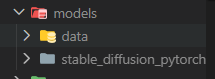
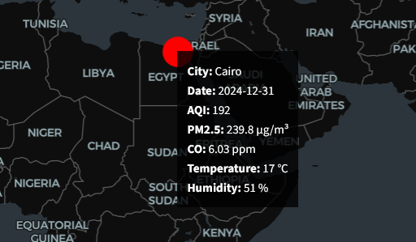
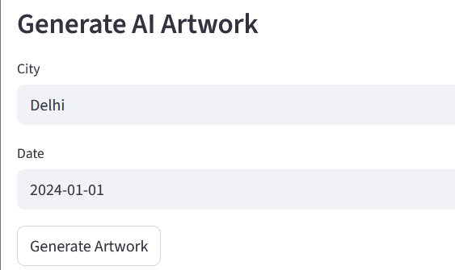
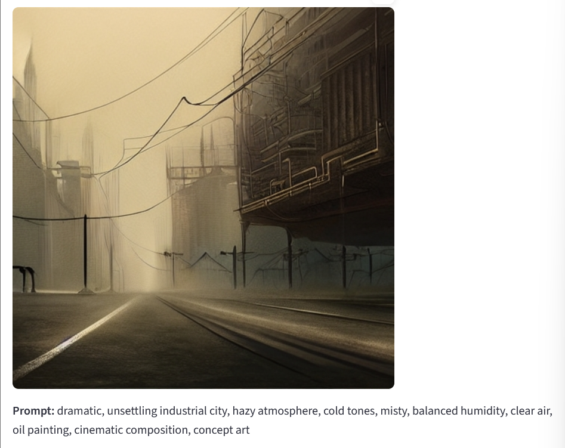

# AI-4-Creativity-Project-Template (25/26)


## Student name: Sapana Chhantyal
## Student number: 2316389 
## Project title: TERRACANVAS: AI ENVIRONMENTAL ART GENERATOR  USING ENVIRONMENTAL DATA
## Link to project video recording: https://uca.cloud.panopto.eu/Panopto/Pages/Viewer.aspx?id=f0dc3b3c-a85f-4172-827b-b3e30082ab13

# Description:
TerraCanvas is an interactive Python program that converts environmental data to AI-generated art. TerraCanvas offers an artistic visualisation of the environmental conditions and air quality in cities by incorporating environmental metrics (e.g., AQI, PM2.5, CO, temperature, humidity) with a local Stable Diffusion model.

# Project Structure:
```bash
TERRACANVAS/
│
├─ models/                        # Place your AI model files here
│   └─ stable_diffusion_pytorch/  # Local repository for Stable Diffusion
│   └─ data/                      # .pt model files (encoder.pt, decoder.pt, clip.pt, diffusion.pt, merges.txt)
│
├─ data/
│   └─ environment_data.csv       # Raw environmental dataset
│
├─ local_sd_ai.py                 # AI artwork generation using local model
├─ local_sd_loader.py             # Model loading helper
├─ prompt_generator.py            # Generates AI prompts from environmental data
├─ main.py                        # Streamlit dashboard
├─ requirements.txt               # Python dependencies
├─ README.md
└─ ... other files

```
# Setup instructions:
1. Clone the repository

```
git clone https://github.com/chhantyalsapana040-spec/TerraCanvas
cd TerraCanvas
```
2. Set up Python environment
```
python -m venv venv
source venv/bin/activate  # Linux/Mac
venv\Scripts\activate     # Windows
pip install --upgrade pip
pip install -r requirements.txt
```
3. Download Models Manually Using the Link:https://huggingface.co/jinseokim/stable-diffusion-pytorch-data/resolve/main/data.v20221029.tar

4. Add Data folder from the downloaded file to models folder on the project
- Extract the downloaded .tar file 
- Place the data folder inside the models folder as shown in the screenshot below:


5. Running the project
After everything is setup use the following commands to setup the project:
```
streamlitrun main.py
```

# Dependencies
Install required packages via:
```
pip install -r requirements.txt
```
# Usage
- You can see the streamlit app running in the browser automatically.
You can see dots and hover over them to see environmental data 

- You can scroll a bit and see Generate AI Artwork.
-Select City and Date and click on generate artwotk to generate the art based on the enviornmental data.


# Generated artwork
-Note: The prompt is generated automatically based on the environmental data.



